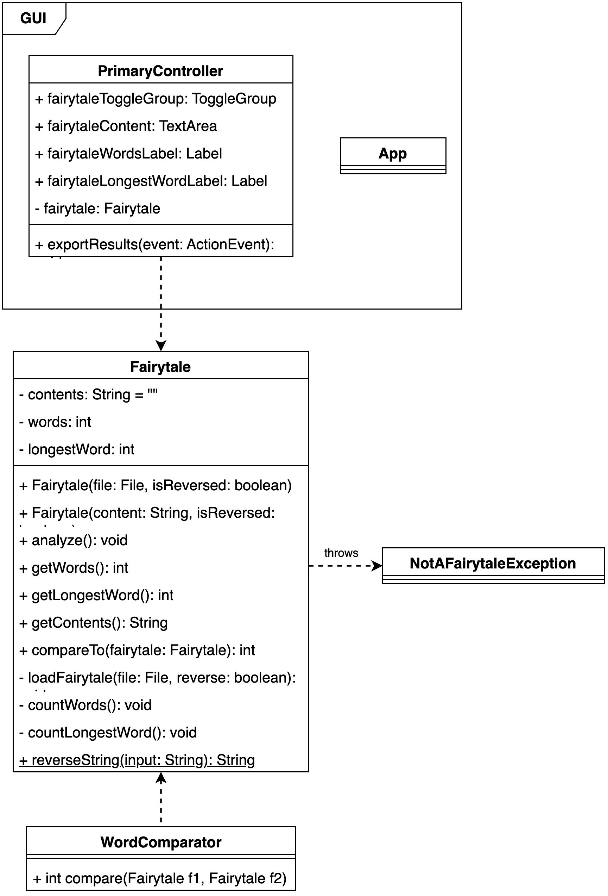
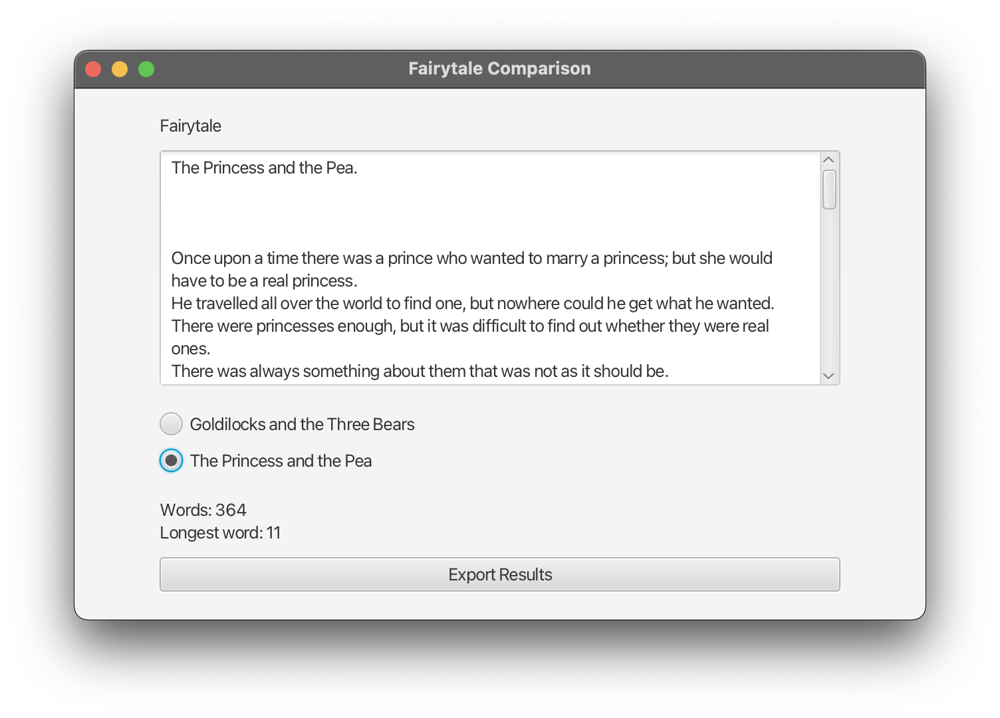
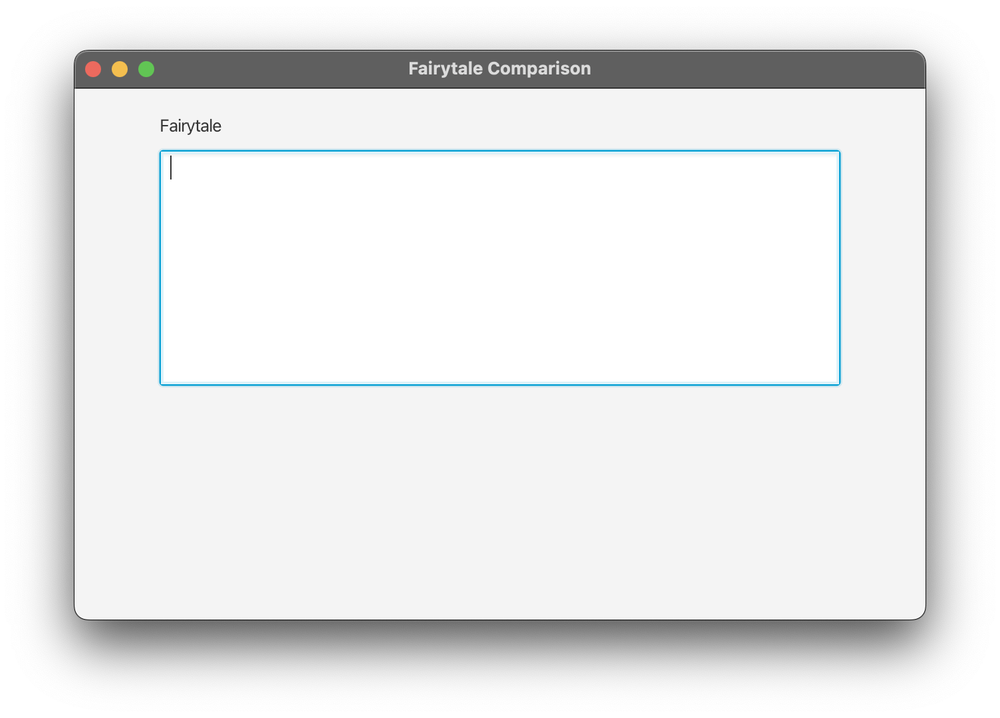

# Point-giving Activity 1

In this task, we will work with file IO, exception handling, constructor overloading, comparisons, and creating GUIs with JavaFX.

We have provided three fairytales within the `fairytales` folder, all ending with a `.fairytale` extension. However, one of the fairytales has each line reversed - as such, we will have to do something to remedy this issue!

When a fairytale has been correctly loaded, it needs to be analyzed such that we know the:
- The amount of words in the fairytale
- The length of the longest word in the fairytale

Once done, we need to implement some logic that allows us to compare two fairytales against each other based on the two characteristics we extracted during the analysis.

Within the `test` folder, you will find relevant tests that verify the solutions through tasks 1-3. Use these tests as you go along to ensure you are correctly completing the tasks. Although the tests are not formally included in your grading, submitting multiple failed tests can provide us with some insight into your proficiency level. **<span style= "color:red">Changes done to the test files will be considered cheating.</span>**

The following class diagram can be used to give you an idea of how the final implementation should look:


Although you are not limited by the boundaries of this diagram, we recommend that you do not deviate too far from this design.

## Task 1 - String reversion

### Task 1.1

The first task is to be able to reverse a string, meaning that _Hello world!_ becomes _!dlrow olleH_. Within the `Fairytale` class, you will find a _static_ method `reverseString(String input)` missing its body. Implement the method such that it reverses the characters shown in the example.

During the mutation of the input string, you should finish the method body by trimming your string before returning it.

**What is trimming?** Trimming refers to removing whitespace at either end of a given String. A string instance in Java contains a `.trim()` method that you may call to satisfy this requirement.

**Hint:**
You can utilize the built-in `reverse()` method in StringBuilder

### Testing your solution

Use the `StringReversibleTest` test to validate your solution.

## Task 2 - Loading and analyzing a fairytale

In this part of the task, we will implement the missing logic within the `Fairytale` class.

### Task 2.1 Implementing the constructors

Start by implementing the code for the two constructors:

- `Fairytale(File file, boolean isReversed)`: Call the `loadFairytale(File fairytale, boolean reverse)` method in the body, providing the relevant parameters to the method.
- `Fairytale(String content, boolean isReversed)`. In this constructor you need to assign a value to `contents`.

  - If `isReversed` is true, pass the argument `content` through your method `reverseString(String input)` and assign that to `contents`
  - Otherwise, assign the argument `content` to `contents`

### Task 2.2 Implementing the loadFairytale method

It's time to load a fairytale from the filesystem. This method is responsible for reading a file and saving it into the `contents` attribute, and should the `reverse` argument be set to `true`, then __each line__ (i.e., not the entire contents of the file at once) should be fed through your `reverseString(String input)` method. Additionally, this method should only allow files ending with a `.fairytale` extension to be read; if not, a `NotAFairytaleException` should be thrown. This exception should be **propagated** and not handled within the method!

**Approach:** 
1. Start by checking if the input files satisfy the extension requirement; if not, throw the `NotAFairytaleException` exception. (Remember, throwing will ensure that the method body is prematurely terminated).
2. Load the file and handle relevant exceptions
3. While going through the file, iterate over each line
   1. Should the reverse flag be `true`, reverse the line
4. Append the current line to the `contents` attribute on the instance.

**Pitfalls:** 

When appending each line to the `contents` attribute, it's easy to forget carriage return (&#92;r) and line feed(&#92;n) (new lines). This results in the following:

````txt
Hello From Line 1
And a hello to you from Line 2
````
becomes
````txt
Hello From Line 1And a hello to you from Line 2
````

When appending each line to the `contents` attribute, you should finish each line by  adding either __&#92;r&#92;n__ or `System.lineSeparator()` to the end of the line.

_Hint: remember to close your files/resources in a correct manner!_

### Task 2.3 Analyzing a fairytale

Now that we've loaded the contents of a file into the `contents` attribute, we can start analyzing the number of words and the count of the longest word.

Three methods need to be implemented:

- `private void countWords()`: Saves the number of words within the `contents` attribute into the `words` attribute.
- `private void computeLongestWordLength()`: Saves the length of the longest word within the `contents` attribute into the `longestWordLength` attribute.
- `public void analyze()`: This method should call the two methods above so that the `words` and `longestWordLength` attributes get populated.

**Hint:**
 To simplify things, you can think of "words" as the combination of characters that are __separated by a space__.

### Task 2.4 Creating the necessary getters

Lastly, we need accessors to retrieve results from the analysis easily. For this task, you should create two getters for the `words` and `longestWordLength` with the signature `public int getWords()` and `public int getLongestWordLength()`, respectively. 

### Testing your solution

Use the `FairytaleTest` test to validate your solution.

## Task 3 - Comparing fairytales

This task consists of two parts: implementing the `Comparable` interface on the `Fairytale` class and creating a new comparator: `WordComparator` that allows us to sort fairytales based on the word count.

### Task 3.1 Implementing the comparable interface

Implement the `Comparable` interface on the `Fairytale` class. The class currently extends from the `GenericFairytale` class. Remove this extension and implement with the `Comparable` interface on the class. This change will also require you to create a comparable method for the class. Implement this method such that the fairytale with **the longest word** takes higher priority.

**Remember to use the `@Override` annotation on your `compareTo` method.**

### Task 3.2 Implementing the comparator class

We will now proceed with the `WordComparator` class. The class has already been provided, however the `Comparator` interface has not yet been implemented. Implement the interface and its accompanying method `compare`, such that the fairytale with **the least amount of words** takes higher priority.

### Testing your solution

Use the `ComparisonTest` test to validate your solution. 

## Task 4 - Creating a GUI

It's time to create our interface, making it possible for our users to use our application.

Below is an example of how the final interface should look. 


The following skeleton has been provided:


The UI allows the user to inspect a fairytale quickly. In our limited application, we're only interested in showing the contents of the two fairytales _Goldilocks and the Three Bears_ (`fairytales/goldilocks-and-the-three-bears.fairytale`) and _The Princess and the Pea_ (`fairytales/the-princess-and-the-pea.fairytale`).

### Task 4.1 RadioButtons and a ToggleGroup

In this section of the task, you should create two `RadioButton`'s, one for each of the two fairytales. When a `RadioButton` is _ticked_ the corresponding fairytale should be loaded into the corresponding `TextArea`. To ensure two RadioButtons cannot be ticked simultaneously, you should assign a toggle group to the two `RadioButton`'s. The `ToggleGroup` have already been provided in the fxml file and within the `PrimaryController`. To use them, you can assign the `toggleGroup` property on the two `RadioButton`'s.

### Task 4.2 Create labels for analysis results

Create two labels showing the total number of words and the count of the longest word within the selected fairytale. If nothing has been picked, these values can default to zero:
```
Words: 0
Longest word: 0
```

Assign relevant `fx:id` ids to them and create corresponding `@FXML` annotated attributes, making them accessible within your `PrimaryController` class.

### Task 4.3 Create Export Results button

Now create a button at the bottom allowing the user to export the analysis results based on the selected fairytale. This button should have an `onAction` property that invokes the `public void exportResults(ActionEvent event)` method on the `PrimaryController`.

### Task 4.4 Loading a fairytale based on RadioButtons

We're ready to load the two fairytales: _Goldilocks and the Three Bears_ (`fairytales/goldilocks-and-the-three-bears.fairytale`) and _The Princess and the Pea_ (`fairytales/the-princess-and-the-pea.fairytale`).

For the RadioButtons', assign the `onAction` property making them invoke the `changeFairytale` method on the `PrimaryController`.

Implement the logic by:

1. Creating a new `Fairytale` instance and pass a file instance pointing to the relevant fairytale (Goldilocks and the Three Bears or The Princess and the Pea), based on the `ToggleGroup's` selected value (these are available to you within the `PrimaryController`).
   1. You can get the selected radio button through the `ToggleGroup` like so: `(RadioButton)fairytaleToggleGroup.getSelectedToggle()`
2. Calling the `analyze()` on the newly created `Fairytale` instance.
3. Set the TextArea's text to the contents of the `fairytale`, using the `.getContents()` getter.
4. Set the word count label to the number of words within the `fairytale` using the `.getWords()` getter.
5. Set the longest word count label to the count of the longest word within the `fairytale` using the `.getLongestWord()` getter.

During the `Fairytale` instantiation, you should handle any exceptions (i.e., `try...catch` them).

**Hint:** Remember that the text files are placed in the fairytales folder.
### Task 4.5 Exporting analysis results to a file

Within this last task, we'll save the analysis results to a `fairytale-export.txt` file. The content of the file should look as follows: 
```
Words: 364
Longest word: 11
The Princess and the Pea.

Once upon a time there was a prince who wanted to marry a princess; but she would have to be a real princess.
He travelled all over the world to find one, but nowhere could he get what he wanted.
There were princesses enough, but it was difficult to find out whether they were real ones.
```
As you can see, we create a file containing the analysis results at the top of the file, and then the fairytale is written to the same file.

Implement the `public void exportResults(ActionEvent event)` method on the `PrimaryController`:

1. Start by checking if none of the two fairytales have been loaded (for example, when you start the program but none of the RadioButtons have been clicked yet), the method should `return`, thus stopping execution, and nothing happens.
2. Create a new file named `fairytale-export.txt`
   1. Write to this file the number words of the related fairytale, on the first line.
   2. Write to this file the count of longest word of the fairytale, on the second line.
   3. Write the entire contents of the related fairytale to the same file on the next line.
   4. Close the file.
