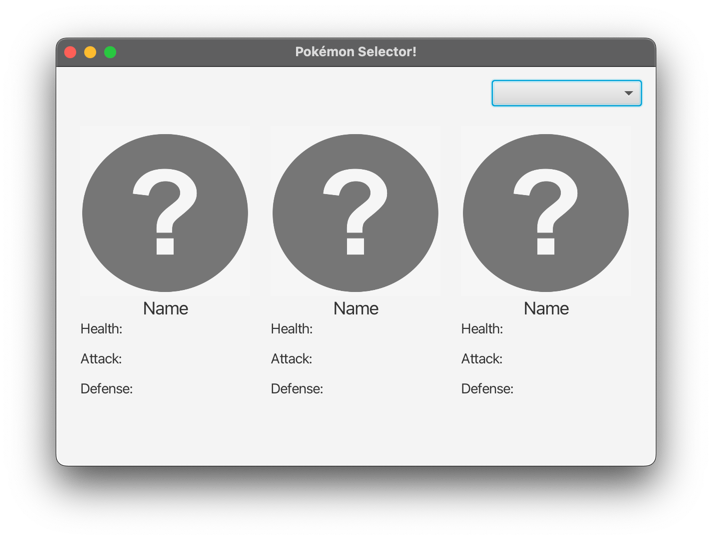
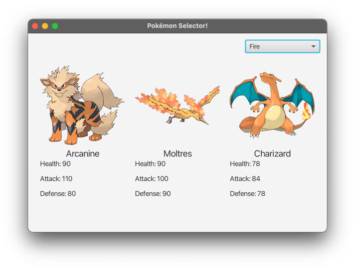

# Point-giving Activity 2
This point giving activity is compromised of two parts. The first part is **Task 1** which focuses on multithreading, 
thread synchronization and thread communication. The second part is **Task 2 & Task 3**, which focuses on reading from files, 
comparing objects and implementing logic into a JavaFX application.

### ⭐Task 2 & 3 can be completed without doing Task 1, so if you get stuck on Task 1 feel free to skip it and focus on Task 2 and 3.

# Task 1 - Threads
This task is based on multithreading, thread synchronization and thread communication. Consider an online library, that allows multiple users to borrow and return books concurrently. The library has a limited number of books available. 
In this task, you need to avoid race condition, such that when one user is borrowing/returning the book, other users will wait until their turn comes.

We have provided 3 classes called `Library.java`, `BorrowTask.java` and `ReturnTask.java` with limited functionality in the package `task1`.

## Task 1a - Library
Complete the implementation for `Library.java`.

Provided code:
  - A private variable `availableBooks` of type `int`.
  - A public constructor to initialise the variable `availableBooks`.
  - A getter method to fetch the value of `availableBooks`.

Implement `borrowBook()` method:
  - (***Hint***: You need to use thread synchronization and thread communication to avoid race condition and deadlock).
  - If the number of `availableBooks` is less than the number of books to be borrowed, then the thread should wait until enough books are available
  - Otherwise, the thread should update the `availableBooks` variable by subtracting the number of books to be borrowed from `availableBooks` variable. 
  - Print the number of borrowed books.
  - Wakeup the waiting threads.
  
Implement `returnBook()` method:
  - (***Hint***: You need to use thread synchronization and thread communication to avoid race condition and deadlock). 
  - Update the `availableBooks` variable by adding the number of books to be returned in `availableBooks` variable. 
  - Print the number of returned books.
  - Wakeup the waiting threads.

## Task 1b - BorrowTask
Complete the implementation for `BorrowTask.java`, which simulates borrowing a book from the library

Provided code:
  - A private variable `library` of type `Library`.
  - A private variable `books` of type `int`.
  - A public constructor to initialise the variables `library` and `books`.

Implement the `run()` method:
  - Invoke `borrowBook()` method (instance method of `Library`).
  - Make sure to catch the relevant exceptions that can be thrown.


## Task 1c - ReturnTask
Complete the implementation for `ReturnTask.java`, which simulates returning a book to the library. 

Provided code:
  - A private variable `library` of type `Library`.
  - A private variable `books` of type `int`.
  - A public constructor to initialise the variables `library` and `books`.

Implement the `run()` method:
  - Invoke `returnBook()` method (instance method of `Library`).
  - Make sure to catch the relevant exceptions that can be thrown.


You can run the tests in `LibraryTest` to ensure you have created the right implementation.
Example of the correct output for `test_library_can_borrow_and_return_books()`: *(Remember the order of borrow/return could vary depending on which thread acquire the lock first)*
```
Borrowed books: 2
Returned Books: 1
Returned Books: 2
Borrowed books: 1
The number of available books=3
```

# Task 2 - Pokémon
In this task a `pokemon.csv` is provided in the root of this project. It contains a list of Pokémon from the game Pokémon.

Each line is comma separated and has the following structure:

`id,name,image,pokemon type,health,attack,defense`.

Each of the seven properties has to be mapped to the provided class `Pokemon.java`.

Once each line has been converted to an object, you should map each Pokémon to their specific type using a map `Map<PokemonType, List<Pokemon>>`

## Task 2A - Pokémon - compareTo

Each Pokémon should be sorted according to their name.

We have provided a `Pokemon.java` class that is partially implemented, only missing the `compareTo` method.

Complete the implementation for:
- `compareTo` method such that two Pokémon are compared against their names, in alphabetical order.

You can run the test `test_pokemon_are_compared_against_names()` in `ComparisonTest` to ensure you have created the right implementation.

Example of the correct output:

```
Beedrill  (Bug)  Health: 65
Charizard  (Fire)  Health: 78
Cloyster  (Ice)  Health: 50
Vaporeon  (Water)  Health: 130
```

## Task 2B - PokemonReader - readFromFile

The `PokemonReader.java` class is going to read from the `pokemon.csv` file and create instances from it.

Implement `List<Pokemon> readFromFile(File file)` to make it read the `.csv` file.
- Create a local instance of the type`List<Pokemon>`
- Open the input file and read one line at a time. Remember that this file is comma "," separated
  - ***Hint*** (Use `split()` method to fetch the seven fields `id,name,image,pokemon type,health,attack,defense`). 
  - Pay attention to numeric strings (*Hint*: `Integer.parse()`)
  - Use `PokemonType.valueOf()` to fetch `pokemonType` field.
- Create a new instance of `Pokemon(..)` passing the fetched values to the constructor.
- Add the newly created `Pokemon` instance to the `List<Pokemon>` instance. 
- Ensure that you enclose the input stream in a try – catch clause and close your input stream after use. 
- Make sure to catch the relevant exceptions that can be thrown.
- Return the list

## Task 2C - PokemonReader - mapPokemon

You now have a complete list of the Pokémon provided in the `.csv` file

Each Pokémon has a type which is one of the following:
- Bug
- Dragon
- Electric 
- Fighting 
- Fire
- Flying
- Ghost
- Grass
- Ground
- Ice
- Normal
- Poison
- Psychic
- Rock
- Water

These types are also defined in the `PokemonType.java` enum.

We now need to group each Pokémon into their respective type using a `Map<PokemonType, List<Pokemon>>`, such that each `PokemonType` points to a list of Pokémon of that type.

`Map<PokemonType, List<Pokemon>> mapPokemon(List<Pokemon> pokemonList)` method is prepared for this task.
Please note that this method takes a `List<Pokemon>` as a parameter.

Implement the body by:
- Create a local instance of `Map<PokemonType, List<Pokemon>>` that holds the Pokémon.
  - ***Hint*** (you can create a HashMap)
- Iterate over the list of Pokémon in the `pokemonList` parameter.
- For each Pokémon instance, use the relevant Getter method of the Pokémon to get the Pokémon type parameter and use this parameter to check if the Pokémon type exists in the map object. See an example for inspiration below:
  `pokemonMap.containsKey(pokemon.getType())`
  - If the Pokémon type does not exist in the map, create a new `Arraylist`, add the Pokémon instance to the new `Arraylist` and put the Pokémon type and its corresponding `Arraylist` in the map.
  - If the Pokémon type already exists in the map, simply add the Pokémon instance to the `Arraylist` of Pokémon belonging to that particular Pokémon type.
  - ***Hint*** (`pokemonMap.get(pokemon.getType()).add(pokemon);`)
  - Continue until you have mapped all Pokémon
- Return the map

If you have completed this task correctly, you can run the`PokemonTest`. It should yield the following output:

```
First 2 Fire:
Charmander  (Fire)  Health: 39
Charmeleon  (Fire)  Health: 58

First 2 Ice:
Seel  (Ice)  Health: 65
Dewgong  (Ice)  Health: 90

First 3 Dragon:
Dratini  (Dragon)  Health: 41
Dragonair  (Dragon)  Health: 61
Dragonite  (Dragon)  Health: 91

First 2 Electric:
Pikachu  (Electric)  Health: 35
Raichu  (Electric)  Health: 60
```

## Task 2D - HealthComparator

We now need to be able to sort the Pokémon based on health.

Within the `HealthComparator.java` file, you will find the `compare(Pokemon p1, Pokemon p2)` method, that is missing its body. Implement the compare logic such that the Pokémon with the highest health comes first. (Pay attention to descending order)
- In case multiple Pokémon have the same health, sort by their name instead (alphabetically).

You can test your implementation by running the test `test_pokemon_are_compared_against_health_using_comparator` in `ComparisonTest` class. If implemented correctly you should get the following output:

```
Articuno  (Ice)  Health: 90
Moltres  (Fire)  Health: 90
Zapdos  (Electric)  Health: 90
Charizard  (Fire)  Health: 78
Caterpie  (Bug)  Health: 45
Kakuna  (Bug)  Health: 45
Abra  (Psychic)  Health: 25
```

# Task 3

We'll now leverage the functionality implemented in Task 2 to create a Pokémon selector. You are given the following skeleton of a JavaFX GUI and need to implement the functionality.


The UI has two features:
1. Using a dropdown to select the `PokemonType` that should be displayed
2. Show the first three Pokémon of the chosen type, based on the Comparator created earlier.

## Task 3A - PrimaryController - initialize()
The `PrimaryController` is partially implemented. It currently has the following attributes:
- 3 `ImageView`s (one for each Pokémon type):
- 12 Labels
    - 3 Name `Label`
    - 3 Health `Label`
    - 3 Attack `Label`
    - 3 Defense `Label`
- `List<Pokemon> pokemonList`
- `Map<PokemonType, List<Pokemon>> pokemonMap`
- `ChoiceBox<PokemonType> choiceBox` (To contain each PokemonType)

Implement the `initialize()` method:
- create an instance of `PokemonReader` and save it to a local variable
- call the `readFromFile()` on the newly created instance and save the results to the `pokemonList` attribute.
- sort the `pokemonList` according to the `HealthComparator` you created earlier.
  - ***Hint:*** `you can use built in sort method`
- call the `mapPokemon(pokemonList)` on the `PokemonReader` instance saving the output in the `pokemonMap` attribute.
- update the `choiceBox` to contain all the `PokemonType` values.
  - ***Hint:*** `choiceBox.getItems().addAll(PokemonType.values());`

## Task 3B - PrimaryController - updatePokemon()
Now you need to implement the `updatePokemon()` method. 
It should update the `ImageView` and the `Label`'s with the corresponding values, based on which `PokemonType` is selected.


- Start by getting the currently selected value in the `ChoiceBox`
  - ***Hint:*** You can use `getSelectionModel().getSelectedItem();` on the `ChoiceBox` attribute and assign it to local variable `selection` of type `PokemonType`.
- Access the `pokemonMap` using the selected value, to get the three `Pokemon` instance of that `PokemonType` with the highest health.
  - ***Hint:*** `Pokemon pokemon = pokemonMap.get(selection).get(0);` to retrieve the first `Pokemon`
- Update each of the 3 corresponding *(name, health, attack, defence)*`Label` to match that of the `Pokemon`'s retrieved from the `pokemonMap`.
  - ***Hint:*** `name1.setText(pokemon.getName());` to update the name of first `Pokemon`.
- Set the image of the `ImageView` to the `Pokemon`'s retrieved. This can be achieved with the following code: `imageView1.setImage(new Image(getClass().getResource("pokemon_images/" + getImage()).toURI().toString()))`;

If implemented correctly, you should see the following if the chosen `PokemonType` is `Fire`:



